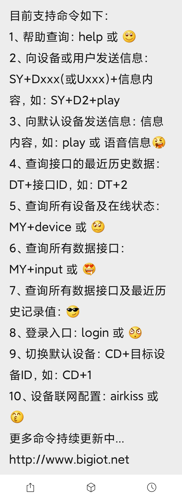
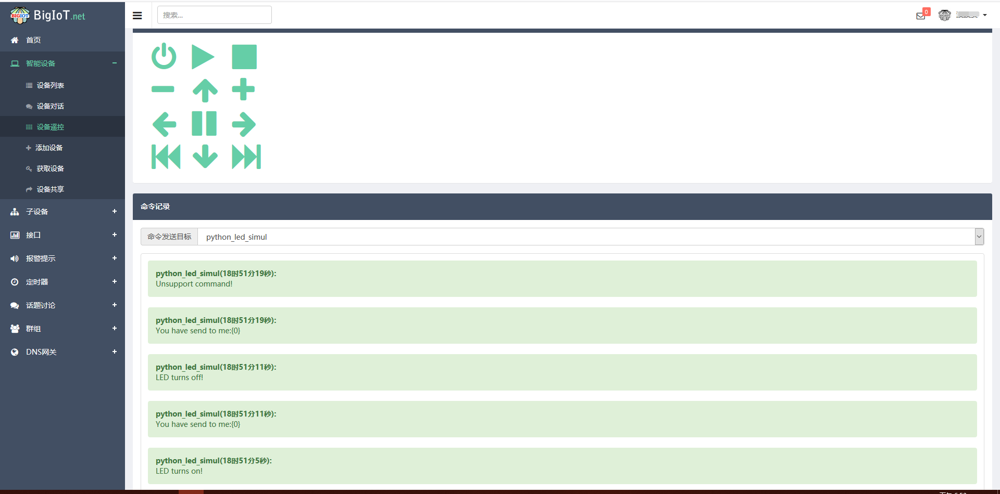
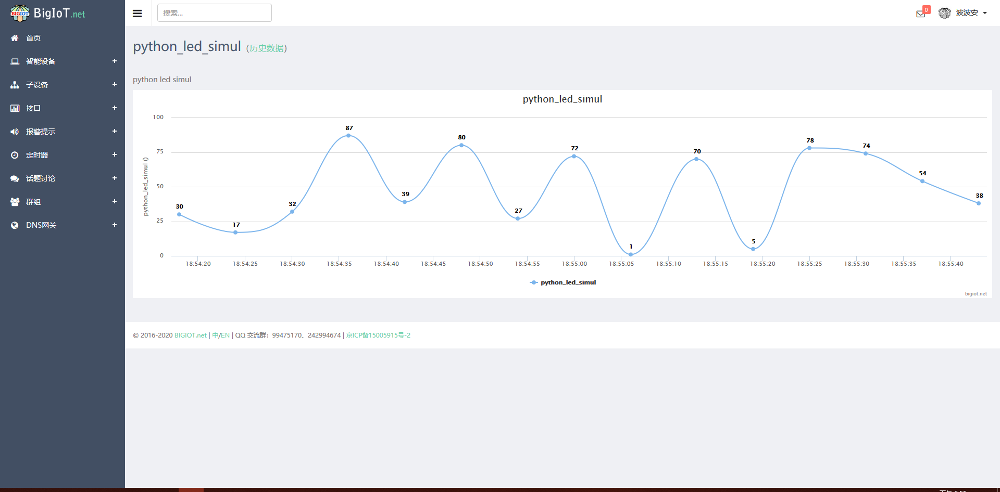
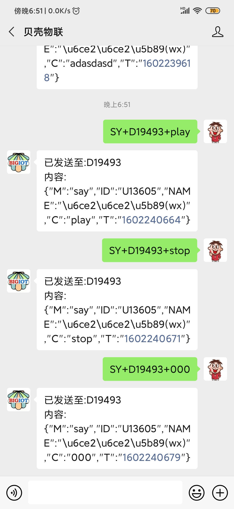
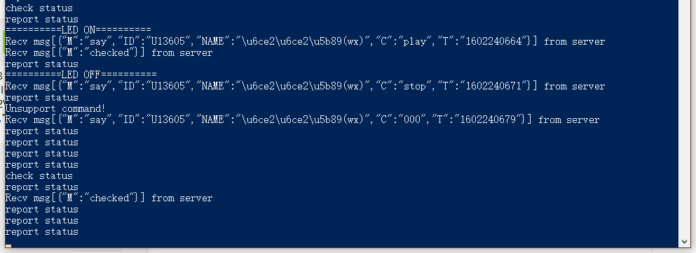
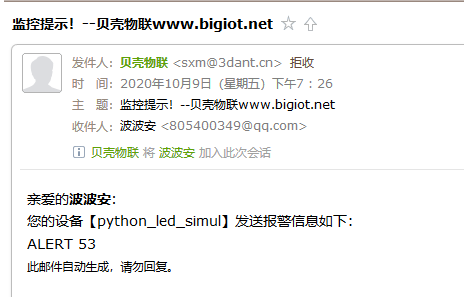

# 贝壳物联

## 通讯协议
* [贝壳物联平台通讯协议](https://www.bigiot.net/help/1.html)

## 账号密码
* 使用QQ登录

## 微信远程控制



```
目前支持命令如下：
1、帮助查询：help 或 
2、向设备或用户发送信息：SY+Dxxx(或Uxxx)+信息内容，如：SY+D2+play
3、向默认设备发送信息：信息内容，如：play 或 语音信息
4、查询接口的最近历史数据：DT+接口ID，如：DT+2
5、查询所有设备及在线状态：MY+device 或 
6、查询所有数据接口：MY+input 或 
7、查询所有数据接口及最近历史记录值：
8、登录入口：login 或 
9、切换默认设备：CD+目标设备ID，如：CD+1
10、设备联网配置：airkiss 或 
更多命令持续更新中...
http://www.bigiot.net
```

# example

```bash
SY+D19493+play # 开灯
SY+D19493+stop # 关灯
```

## 代码示例

* [基于树莓派 Python gpiozero 远程控制LED灯并返回控制结果](https://www.bigiot.net/help/26.html)











## 语音控制

* [ESP8266+天猫精灵+贝壳物联 简单直接点亮一个LED灯](https://blog.csdn.net/u010053463/article/details/99652606)
* [小爱同学控制esp8266点灯(Blinker)](https://www.jianshu.com/p/fbcd49573113)
* [点灯科技-小爱同学接入](https://www.diandeng.tech/doc/xiaoai)

> 注意: 贝壳物联目前不支持小爱同学, 想用小爱同学控制可以选择电灯科技